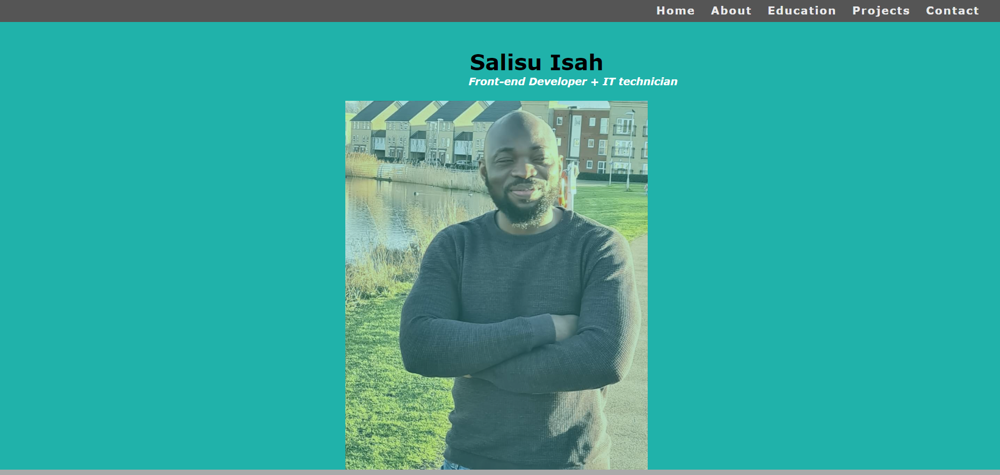
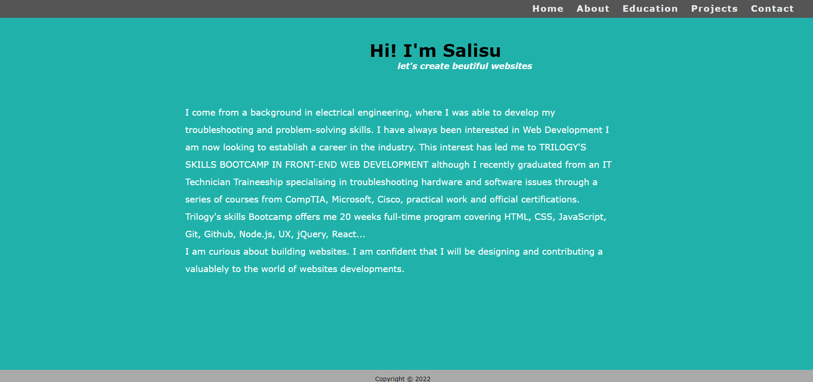
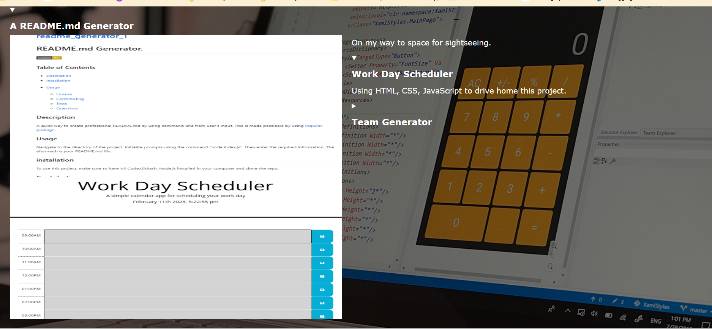
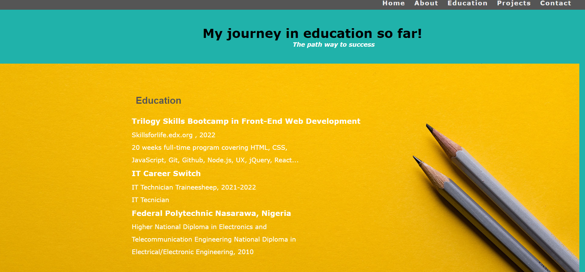
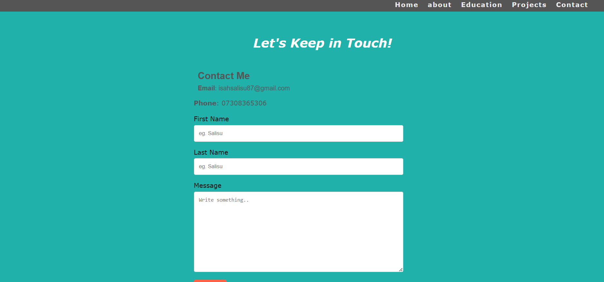

# My Portfolio

This is my portfolio website where I showcase my projects and skills.

## Table of Contents

- [Description](#description)
- [Features](#features)
- [Technologies Used](#technologies-used)
- [License](#license)

## Description

My portfolio website is built using HTML, and CSS. It includes a home page with a brief introduction, a portfolio page with examples of my projects, and a contact page for getting in touch.

## Screenshots
 

## Features

- Home page with introduction
- Portfolio page with examples of my projects
- Contact page for getting in touch
- Responsive design for mobile and desktop

## Technologies Used

- HTML
- CSS
- Git
- GitHub

## License

This project is licensed under the [MIT License](LICENSE).

